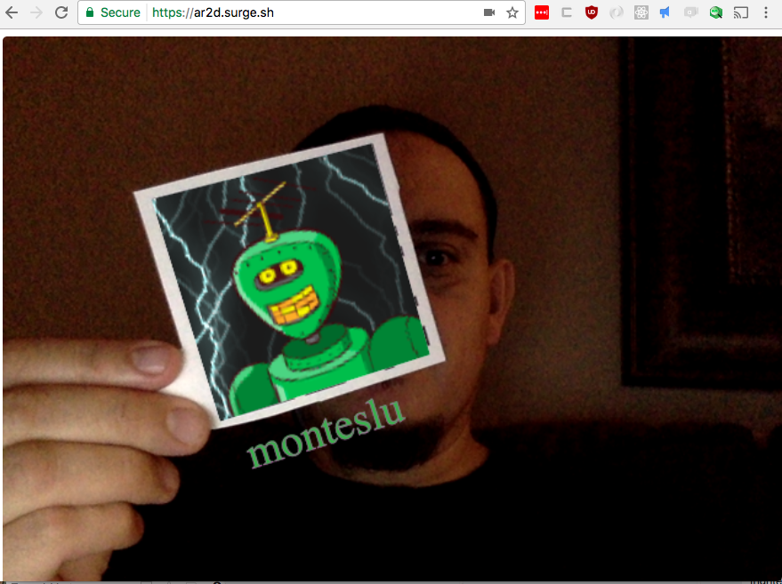

Augmented Reality in 2D with QR codes
=====================================





Simple app to demonstrate Augmented Reality using 2D QR codes.

This app is up and running at: [https://ar2d.surge.sh](https://ar2d.surge.sh)

Fire it up, and hold up a QR code to your webcam.


Or you can run it locally:

## Build it

```
npm install
npm run build
````

## Run it

```
npm run start
````

## View it

Then view the app:
[http://localhost:3012](http://localhost:3012)
